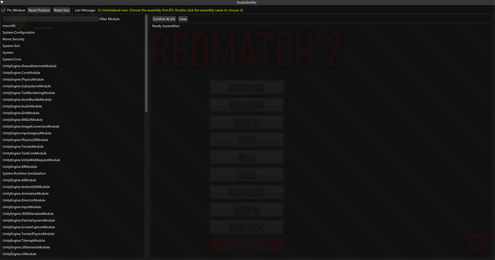

# Il2CppDynamicDumper

This is a tool for dynamic dump il2cpp.

## Usage

1. Set the right il2cpp type file in Core.h
2. Compile it
3. Inject to the game

## License

Il2CppDynamicDumper is licensed under the MIT License, see [LICENSE.txt](../LICENSE.txt) for more information.